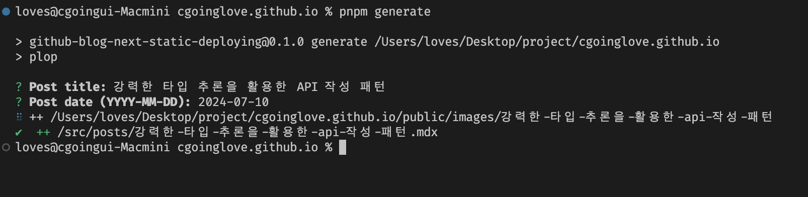

# Blog

> [Go Site](https://cgoinglove.github.io/)

[Next.js](https://nextjs.org/) export 로 구축된 정적 블로그로, GitHub Pages에 호스팅됩니다. [Plop.js](https://plopjs.com/)을 사용하여 포스트 생성을 정규화하고 GitHub Actions로 자동 배포됩니다. 정적 사이트 생성을 위해 [next-remote-mdx](https://nextjs.org/docs/app/building-your-application/configuring/mdx#remote-mdx)와 [glob](!https://github.com/isaacs/node-glob#readme)을 활용합니다.

## 새 포스트 생성

커맨드 사용하여 손쉽게 새 포스트를 생성하세요.

```bash
pnpm generate

# 제목과 날짜를 직접 제공할 수도 있습니다:
pnpm generate 'Your Title' '2022-03-03'
```

포스트 제목과 날짜를 입력하는 프롬프트를 따르세요. 그러면 src/posts에 새 MDX 파일과 public/images에 해당 이미지 폴더가 생성됩니다.



### Plop Template 'post.hbs'

```mdx
---
title: '{{title}}'
date: '{{date}}'
thumbnail: '/images/{{slugify title}}/'
---

Write your post content here.
```

## Deployment

GitHub Actions를 통해 새 포스트를 자동으로 배포합니다. 변경 사항을 커밋하고 푸시하세요:

```bash
git add .
git commit -m "Add new post"
git push origin main
```

## Testing

[Vitest](https://vitest.dev/) Plop 생성기와 포스트 파서를 테스트합니다.

### Plop Generator Test

새 포스트와 이미지 폴더가 올바르게 생성되는지 Plop 생성기를 테스트합니다.

```typescript
it('should generate a new post and image folder', () => {
  // ...
  await runPlop(title, date);
  expect(postExists).toBe(true);
  expect(imageFolderExists).toBe(true);
});
```

### Post Parser Test

메타데이터와 콘텐츠가 올바르게 처리되는지 포스트 파싱과 생성을 테스트합니다.

```typescript
beforeAll(() => {
  const testContent = `
        ---
        title: "Test Post"
        date: "2024-07-04"
        thumbnail: "image.jpg"
        ---

        # Heading

        This is a test post.`;
  fs.writeFileSync(testFilePath, testContent);
});

it('should generate a post with valid metadata and content', () => {
  const post = generatePost(testFilePath);

  expect(post.metadata.title).toBe('Test Post');
  expect(post.metadata.date).toBe('July 4, 2024');
  expect(post.metadata.thumbnail).toBe('image.jpg');
  expect(post.metadata.summary).toBe('Heading This is a test post.');
  expect(post.content).toContain('# Heading');
  expect(post.slug).toBe('temp');
});
```
