인터넷 커뮤니티를 뜨겁게 달군 프로젝트 중 하나인 [r/place](https://namu.wiki/w/r/place)를 알고 계신가요?

이 프로젝트는 전 세계 사람들이 하나의 캔버스를 동시에 편집할 수 있도록 했어요.

1명의 사용자가 5분마다 1픽셀씩 수정할 수 있는 간단한 규칙으로 진행되었어요.

몇몇 사용자는 디스코드 채널을 열어 협력했어요. 예를 들어, 자신의 나라 국기를 그리거나 특정 이미지를 완성하기도 했죠.

하나의 문서를 여러 Peer(사용자)가 동시에 수정하게 하려면 어떻게 개발 해야 할까요?

이번 글에서는 이런 동시 작업의 핵심 기술인 CRDT를 구현한 여러 알고리즘이 있지만, 그중 제가 간단하게 구현해본 **RGA(Replicated-Growable Array)**를 기준으로 실제로 어떻게 작동하는지 보여드리려고 해요.
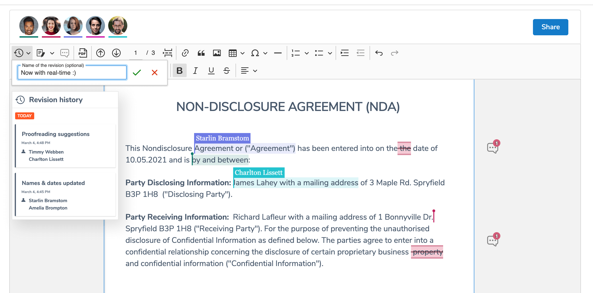

CRDT의 활용 사례는 많지만, 가장 이해하기 쉬운 예가 동시 문서 편집이에요. 그래서 동시 문서 편집을 중심으로 설명해볼게요.

---

## ❌ 일반적인 동시문서 편집

> CRDT 알고리즘이 어떤 효과를 얻을 수 있는지 알아보기위해
> `게시판 CRUD` **+** `실시간을 위한 SOCKET 통신` 스택을 사용한 시나리오

A, B, C 라는 세 사용자(PEER)가 실시간으로 한개의 게시판글을 수정한다고 가정해볼게요.

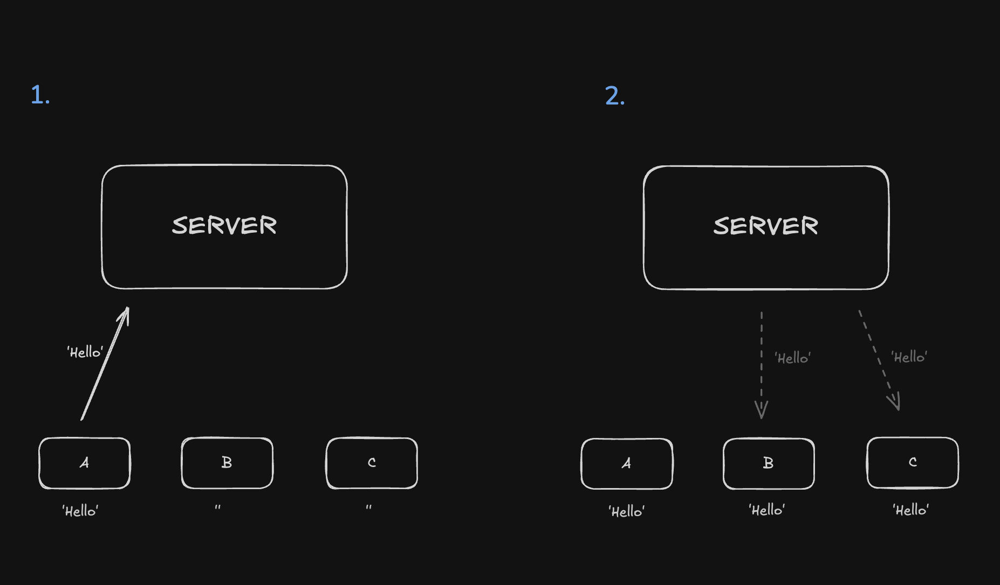

1. A가 먼저 **'Hello'라는 문서를 작성해 Server에 전송**해요.
2. Server는 이것을 저장하고 **B와 C에게 수정본 'Hello'**를 전송하죠.
   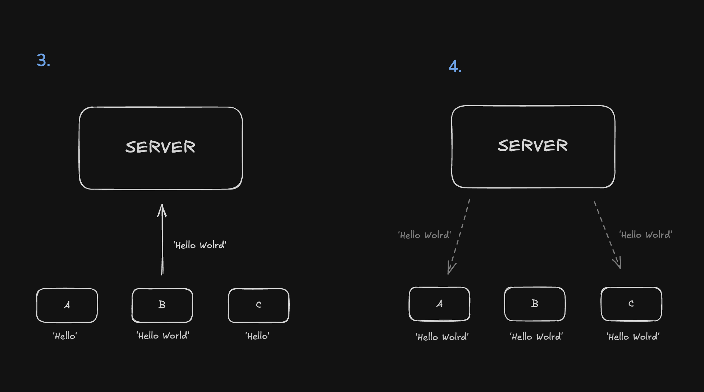
3. B는 'Hello' 뒤에 **'World'를 추가해** 'Hello World'를 Server로 보내요.
4. Server는 이것을 **A와 C에게 전송**해요.

**결과적으로 A, B, C 모두 'Hello World'라는 동일한 내용을 받게 돼요.**

- Peer들이 Server에 문서를 전송하고
- Server는 문서를 단독으로 수렴하고 관리하는 주체가 되어
- 수정된 문서를 Peer들에게 다시 전송(BroadCast) 하게 돼요.

---

### ⚠️ 하지만 이런 구조에는 몇가지의 문제가 발생합니다.

> #### 동시 수정 충돌 문제

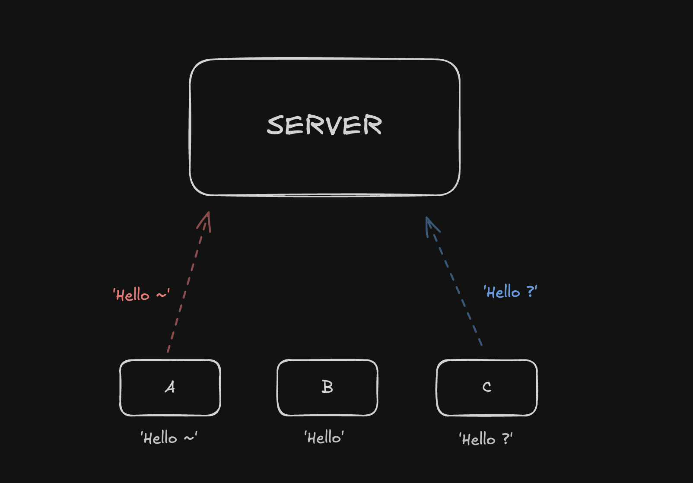

<span style={{ color: '#f7706f' }}>**A는 `Hello` -> `Hello ~`**</span>
<span style={{ color: '#579ae0' }}>**C는 `Hello` -> `Hello ?`**</span>{' '}

거의 동시에 수정하고 Server에 전송했다면 어떻게 될까요?

<br />
0.1초 차이로 좀더 빠르게
<span style={{ color: '#f7706f' }}>A가 Server 에 `Hello ~`</span>를 전송했지만,
아직 **A의 수정 내용을 B,C에게 전달 하기 전**에
<span style={{ color: '#579ae0' }}>C가 `Hello ?` 를</span> Server 에 전송하게
되는 케이스 에요.
<br />

우선 Server 입장에서는 조금 뒤늦게 들어온 <span style={{color:'#579ae0'}}>C의 `Hello ?`</span> 를 최종적으로 수렴하고 저장 하게 될거에요.

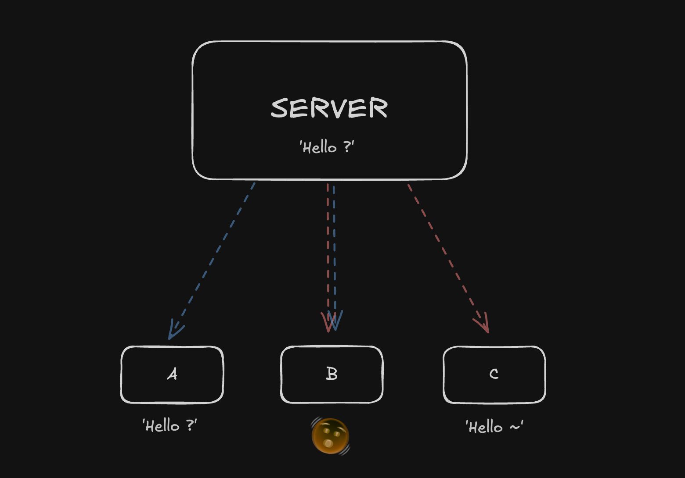

하지만 이후 전송(broadcast)되는 다른 내용때문에 A,B,C 각각 다른 내용이 될 수가 있습니다.

물론 Peer 측에서 LWW(last writer wins)규칙으로 늦게 들어온 문서를 반영하며 해결 할 수 있지만,
만약 이 문제가 문서의 각각 다른 영역을 수정한 내용이라고 한다면 어떨까요?

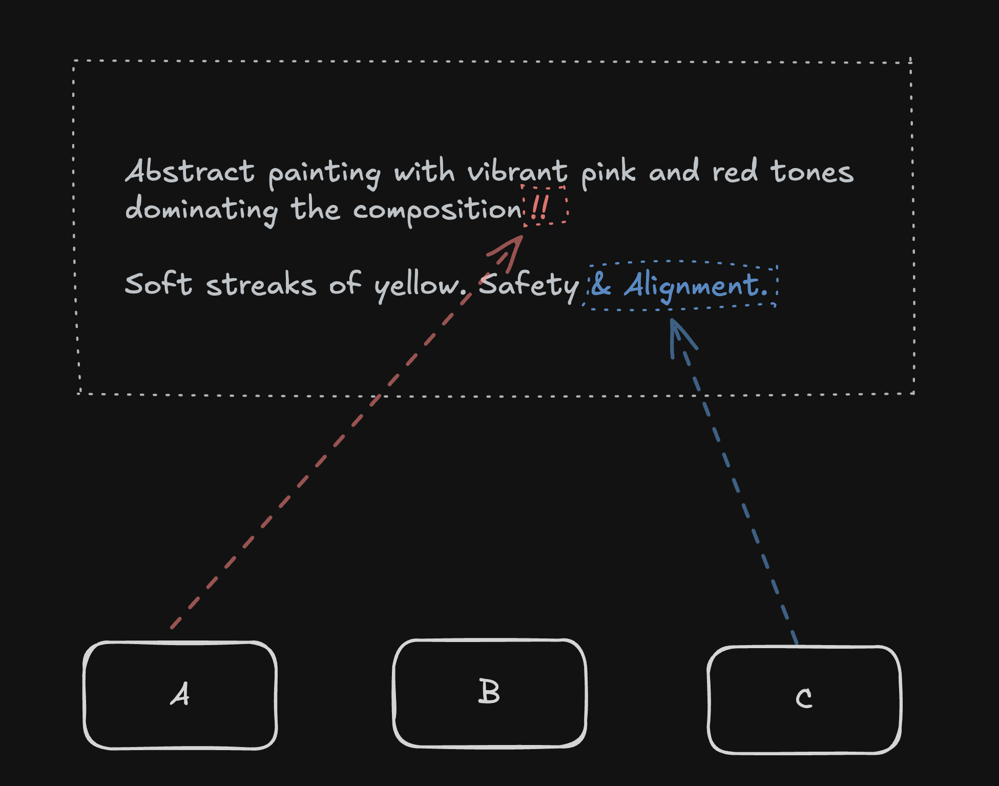

동시에 전송하게 된 타이밍이라면 누군가의 수정작업은 무시가 될 수 도 있어요.

> #### 데이터 전송 크기의 문제

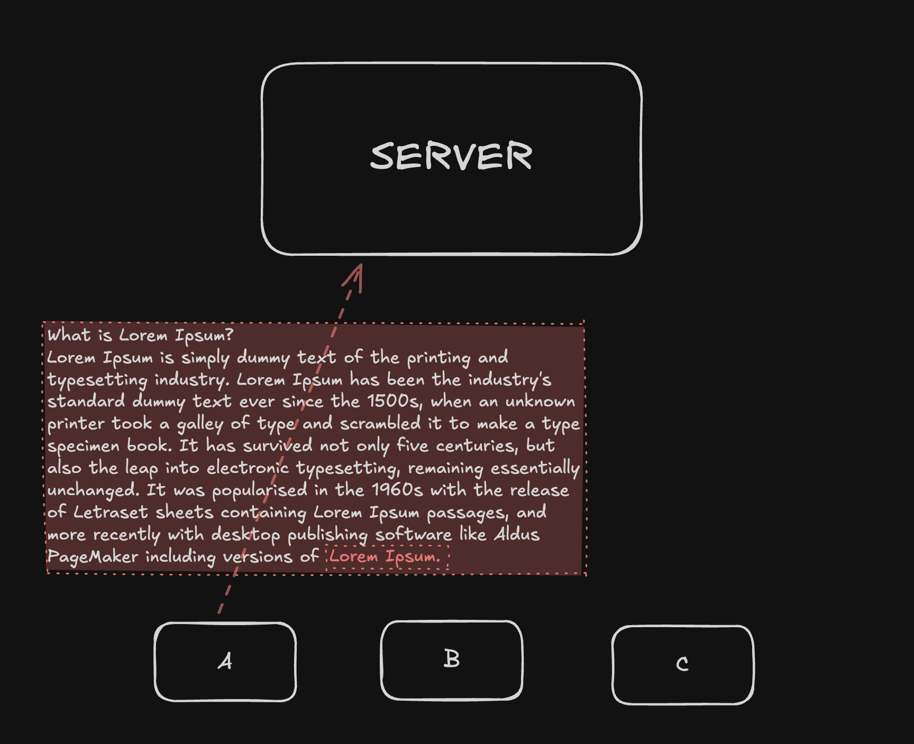

지금 제가 보여드린 예제 문서들은 아주 작은 `'Hello ?'` 정도의 짧은 TEXT 이지만
만약, 엄청난 양의 큰 문서인 경우에는 아주 작은 **한 글자 수정에도 전체 내용을 전송**하게 돼요.

실제로 게시판 CRUD를 구현할 때 한글자의 Update에도 전체 문서를 전송하는 것 처럼요.

실시간으로 수정돼야하는데 매번 이렇게 큰 데이터를 전송 하고 받을 수 없겠죠?

---

## ✅ CRDT 동시문서 편집

CRDT(Conflict-free Replicated Data Type)를 그대로 해석하면 충돌에서 자유로운(없는) 복제된 데이터 타입 이에요.

위의 `❌ 일반적인 동시문서 편집` 과 가장큰 차이점 2가지를 먼저 말씀 드릴게요.

<br />

### 첫 번째 특징: 작업기반 전송 (Operation-Based)

첫번째로 문서 전체가 아닌, 수정한 작업만 전송하게 됩니다.

```typescript
interface Operation {
  type: 'insert' | 'delete';
  id: string;
  parentId?: string;
  value: string;
}
```

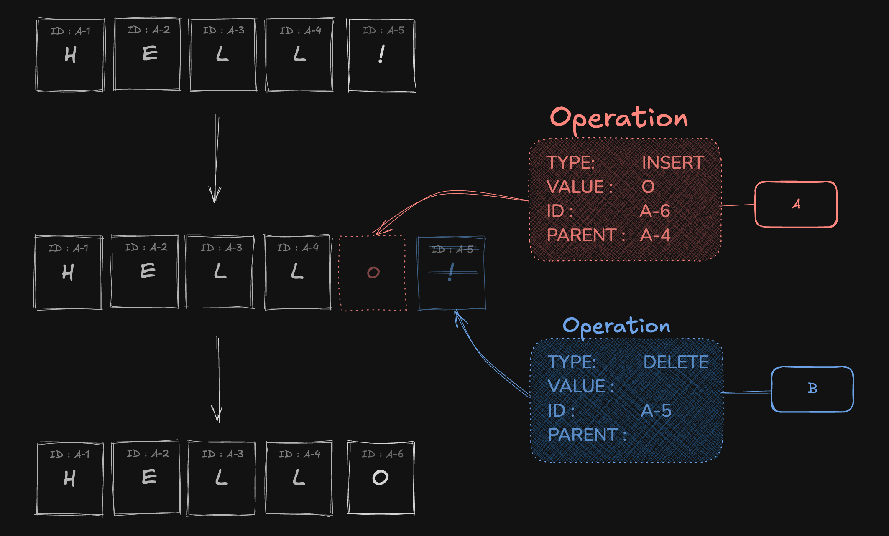

<br />

<span style={{ color: '#f7706f' }}>A 는 'L' 뒤에 'O' 를 추가</span> 했다고 작업
내용을 전송하고,

<span style={{ color: '#579ae0' }}>B 는 '!' 를 삭제</span> 했다고 작업 내용을
전송하죠
<br />

전송 방식의 변화만으로 수정된 전체 문서를 보낼 필요가 없어 `⚠️데이터 전송 크기의 문제`를 해결 할 수 있고,

A,B가 동시에 보내졌던 내용들도 각각의 operation(작업) 이기 때문에 두개의 작업을 같이 수렴(merge)할 수 있게 되어 `⚠️동시 수정 충돌 문제` 또한 해결 할 수 있게돼요.

### 두 번째 특징: 분산된 레플리카(Replica) 기반 구조

동시문서 편집에서 가장 중요한 점은, 여러 Peer들이 동일한 문서를 보고 있어야 한다는 것이죠.

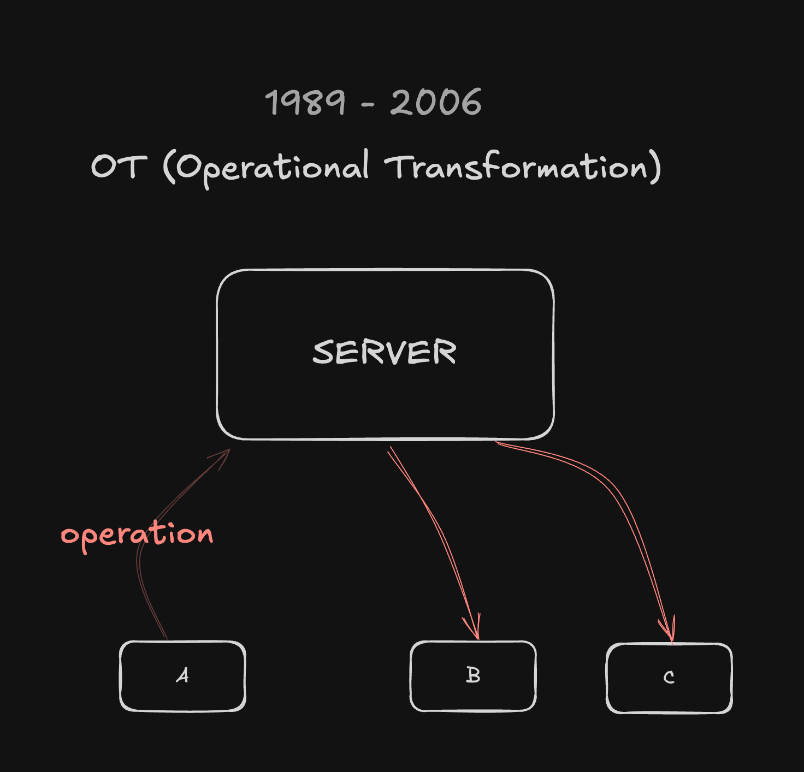

기존 방식에서는 각 Peer가 Server로 문서 수정 내용(Operation)을 전송하면 Server가 모든 수정을 수렴(merge)하고 관리한 뒤 다시 피어들에게 전파했어요.

이 방식은 Peer 들이 잘못된 Operation 을 보내거나 Operation 이 충돌이 되더라도
(예: 동시에 같은 부모 뒤에 insert 를 한 경우)
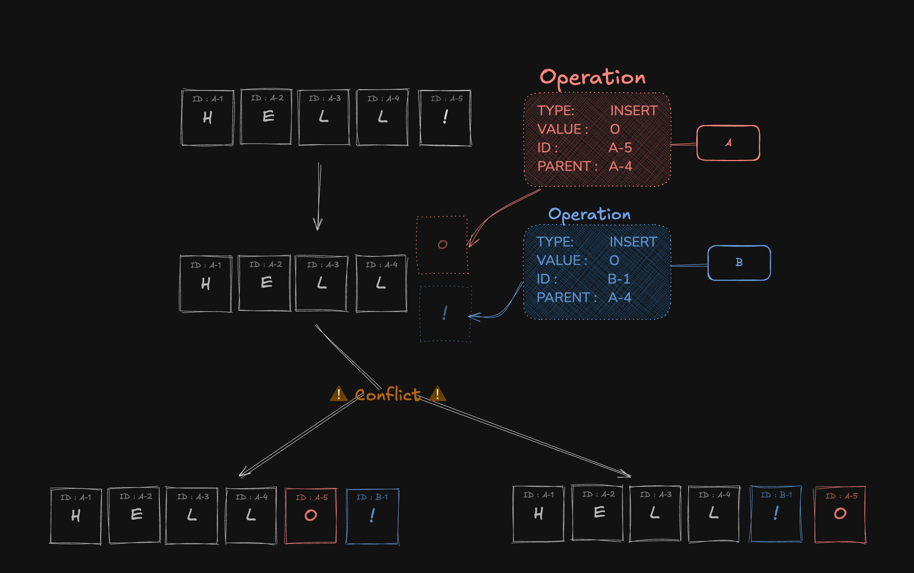

Server만 Operation을 받아 수렴하고 관리 하며 Peer에게 전송해줍니다.

> 결국 문서 관리는 Server가 주체가 되어 독단적으로 관리하게 되니, 모든 Peer 들은 안정적으로 같은 결과를 갖게 되는 것이죠.
> ~~OT도 P2P 구조가 가능은 하지만 구현·운영 난이도가 훨씬 높아 중앙 서버 방식으로 주로 사용된다~~

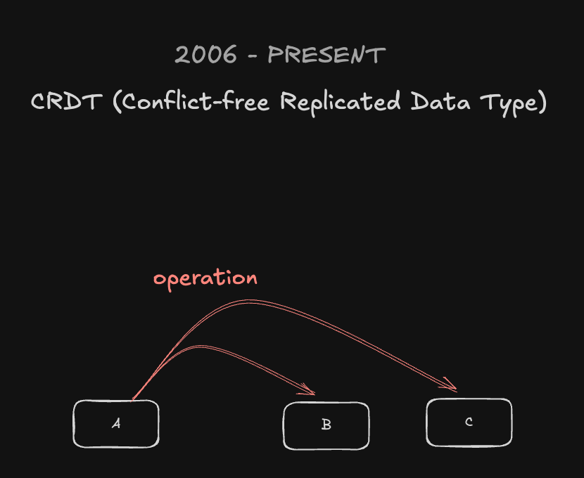

그러나 CRDT 환경에서는 중앙 서버가 문서를 단독으로 다루지 않습니다.

문서를 수정할 때마다 생성되는 연산(Operation)을 다른 피어들에게 직접 전송하고, 모든 피어가 이를 직접 받아 로컬에서 merge하며 문서를 수렴하게 됩니다.

기존에 Server가 문서를 단독으로 관리(OT 방식)하는 대신, CRDT는 충돌하는 Operation들을 효과적으로 병합할 수 있도록 각 Peer의 알고리즘에 집중해, 결과적으로 모든 Peer가 같은 최종 문서를 보게 만듭니다.

> **정리하자면 결과적으로 모든 Peer가 동일한 문서를 보기 위해**,

- 기존 방식(OT)은 서버가 모든 작업을 수렴하고 이를 Peer들에게 전송하는 구조로 단순 구현이 가능하고 안정성을 제공했지만, 높은 서버 비용과 확장성의 제약이 있었습니다.
- 이에 반해 CRDT는 P2P 기반으로 각 Peer가 독립적으로 작업을 수렴하고 병합하는 방식을 채택해, 서버 의존도를 줄이고 확장 가능한 시스템 운영이 가능하도록 설계되었습니다.

## Merge: CRDT 알고리즘의 핵심

CRDT 알고리즘의 핵심은 바로 병합(Merge)입니다. 그래서 CRDT에서 병합이 가지는 조건과 중요성을 깊이 이해하는 것이 필요했습니다. 병합 함수는 모든 피어가 동일한 결과에 도달하도록 보장하기 위해 아래 세 가지 속성을 만족해야 합니다.

### 멱등성 (Idempotence)

- **정의:** 동일한 연산을 여러 번 적용해도 결과가 달라지지 않아야 합니다.
- **설명:** CRDT에서 같은 상태를 여러 번 병합해도 최종 결과는 항상 동일합니다.
  - 예: `{A, B} ∪ {A, B} = {A, B}`

---

### 교환법칙 (Commutativity)

- **정의:** 두 연산의 적용 순서가 달라도 최종 결과가 동일해야 합니다.
- **설명:** 분산 환경에서 네트워크 지연 등으로 인해 연산 순서가 달라지더라도, 최종적으로 데이터가 일관된 상태로 수렴할 수 있습니다.
  - 예: `A + B = B + A`

---

### 결합법칙 (Associativity)

- **정의:** 병합 연산의 그룹화 방식이 달라도 결과가 동일해야 합니다.
- **설명:** 여러 개의 상태를 병합할 때, 병합 순서와 관계없이 동일한 결과를 얻어야 합니다.
  - 예: `(A ∪ B) ∪ C = A ∪ (B ∪ C)`

---

## 왜 이 조건이 중요한가?

이 세 가지 속성은 CRDT의 병합 연산을 정의하는 데 필수적입니다. 이를 기반으로 CRDT는 다음을 보장합니다:

1. **충돌 해결 없이 데이터 수렴:** 네트워크 지연과 같은 상황에서도 데이터가 일관성을 유지.
2. **분산 환경에서 안정성:** 중앙 서버 없이도 동기화 가능.
3. **중복 처리 허용:** 동일한 연산이 여러 번 전파되어도 최종 결과에 영향을 미치지 않음.

---

## 구현 사례: RGA (Replicated-Growable Array)

> 이제 제가 직접 구현한 RGA(Replicated-Growable Array)의 인터페이스를 소개하겠습니다. 이 구현을 통해 동시 작업 중 발생할 수 있는 충돌을 어떻게 해결했는지 하나씩 살펴보겠습니다.

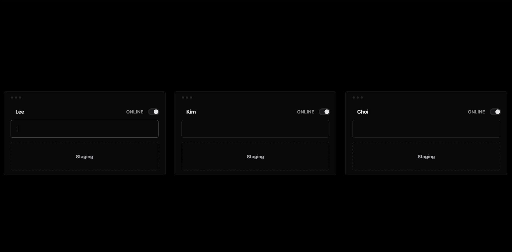

가장먼저 Operation이 문서가 되는 과정을 보여드릴게요.

### Node & Operation 인터페이스

```typescript
interface Operation<T> {
  type: 'insert' | 'delete'; // 작업 유형
  id: string; // 작업 고유 ID
  parentId?: string; // 삽입된 부모 노드의 ID
  value: T; // 삽입 또는 삭제된 값
}

interface Node<T> {
  value: T; // 노드에 저장된 값 (string)
  deleted: boolean; // 삭제 여부 표시
  next?: Node<T>; // 다음 노드를 가리키는 포인터

  append(node: Node<T>); // 새로운 노드를 현재 노드에 연결합니다.
}
```

Operation 객체는 insert와 delete 작업을 나타내며, 각 작업은 고유 ID와 부모 노드의 ID를 포함하여 Node의 위치를 지정하거나 삭제를 추적할 수 있도록 설계되었습니다.

```typescript
it('should create a node with "Hello Wolrd"', () => {
  const head = new Node('Hello');

  head.append(new Node(' World'));

  expect(head.value).toBe('Hello');
  expect(head.next.value).toBe(' World');
  expect(head.next.next).toBeUndefined();

  let node = head;
  let document = '';

  // next 가 없을때 까지
  while (node != undefined) {
    document += node.value;
    node = node.next;
  }

  expect(document).toBe('Hello World'); // 문서
});
```

Node 객체는 Linked List의 형태로 연결되어 문서 구조를 나타냅니다.

결국 Node의 순회가 문서가 되는건데, Node의 append(insert), delete 를 하기위해 append 할 부모의 ID, 혹은 delete 할 Node 의 ID 정보가 담긴 Operation 으로 하게 됩니다.

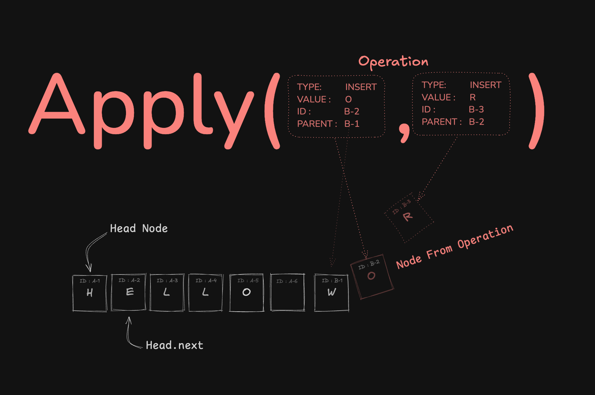

### RGA 인터페이스

```typescript
interface RGA {
  // Document
  head: Node<Operation>;

  // 아직 다른 Peer 에게 전송하지 않은, local 에서의 작업 내용
  staging: Operation[];

  // operation을 Node(head) 에 반영
  // insert 경우 부모 Node를 찾아 append 하고, delete 경우 Node deleted = true
  apply(operation: Operation);

  // insert operation 생성후 apply & staging에 추가
  insert(value: string, parentId?: ID): Operation;

  // delete operation 생성후 apply & staging에 추가
  delete(id: ID): Operation;

  // 다른 peer가 전송한 operation 들을 apply
  merge(operations: Operation[]): void;

  // staging 에 있는 opertion 들 비우며 반환
  commit(): Operation[];

  // head 를 순회하며 문자열 반환
  stringify(): string;

  // 반영하지 못하는 Operation 대기열
  buffer: Operation[];
}
```

이 인터페이스는 Git의 워크플로우와 유사한 네이밍을 사용하여 작업의 추가, 삭제, 병합, 커밋 단계를 명확히 구분할 수 있도록 설계되었습니다.

```typescript
// 2개의 Peer 를 생성.
const A = new RGA('A');
const B = new RGA('B');

// 부모가 undefined 는 맨 앞에 추가하게 됨 root
const firstOperation = A.insert('Hello', undefined);

// 위에 생성한 'Hello'의 next로 ' World' 생성
A.insert(' World', firstOperation.id);

// Node('Hello') -> Node(' World')
A.head;

//  [ insertOperation('Hello') , insertOperation(' World') ]
A.staging;

const operations = A.commit();

//  [ insertOperation('Hello') , insertOperation(' World') ]
operations;

// [] empty
A.staging;

B.merge(operations);

// Node('Hello') -> Node(' World')
B.head;

(A.stringify() == B.stringify()) == 'Hello World';
```

위 예제는 두 개의 분리된 Peer가 동일한 작업을 공유하여 같은 문서 상태를 유지하는 과정을 보여줍니다.

### `A` Peer 의 insert 함수 내부

- Insert Operation 을 생성
- 생성된 Operation을 apply() 를 통해 본인의 node 에 반영
- 생성된 Operation을 staging에 추가

### `B` Peer 의 merge 함수 내부

- peer1이 생성한 Operation을 apply() 를 통해 본인의 node 에 반영

A가 작업을 수행하고 commit한 내용을 B가 merge하여 두 Peer가 동일한 결과를 얻습니다.

`commit()` 은 단순히 자신의 staging 을 리턴하고 비우는 작업만을 하게 됩니다.

실제로 서비스에서 사용할 경우 다른 Peer에게 전송하는 방식이 각각 다를 수 있기 때문에 이런식으로 구현하게 됐습니다.

---

### 1. 동일 연산 충돌 처리

만약 A와 B가 동시에 동일한 부모 노드 아래에서 `insert` 작업을 수행하면 충돌이 발생합니다.

이를 해결하기 위해 Operation의 `id`를 기준으로 우선순위를 결정 하게 됩니다.

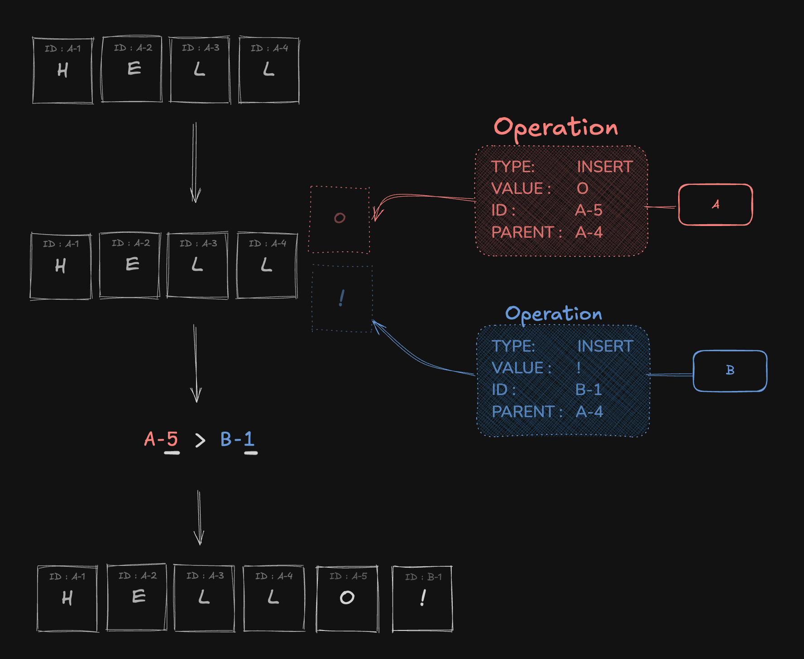

Operation의 `id`는 `${논리 시계(또는 타임스탬프)}+${Peer ID}` 형식으로 생성됩니다.

- **Logical Clock or Vector Clock**: Logical Clock 을 설명하기엔 내용이 길어져 단순히 timestamp 로 생각하셔도 됩니다.
- **Peer ID**: 인스턴스 생성 시 부여되는 고유 ID입니다. 예: `new RGA('A')`의 경우 Peer ID는 `'A'`입니다.

충돌 발생 시 우선 `Logical Clock` 값을 비교하고, 값이 동일하다면 `Peer ID`를 기준으로 우선순위를 결정합니다.

### 2. 교환법칙(가환성) 문제

다양한 Peer가 서로 다른 네트워크 환경에서 작업을 병합할 경우, Operation의 도착 순서가 달라질 수 있습니다.

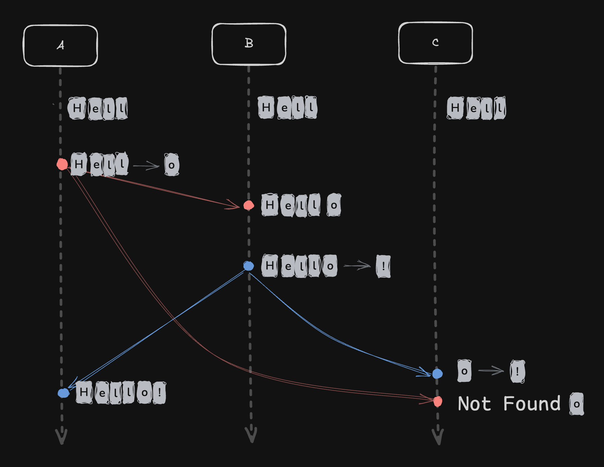

예를 들어:

- A가 Operation('O')을 생성하고, B는 이를 병합한 뒤 Operation('!')를 생성 합니다.
- C는 네트워크 지연으로 인해 B의 Operation을 먼저 수신하고, 이후 A의 생성 Operation을 받습니다.

이런 경우 C의 입장에서 B의 Operation('!')은 부모 노드가 없으므로 바로 적용되지 못하고, `buffer`에 보관됩니다.

이후 A의 생성 Operation이 병합되면, 병합이 완료된 뒤 `buffer`를 다시 확인하여 B의 Operation을 적용합니다.

`merge` 함수는 다음과 같이 작동합니다:

1. 받은 Operation들을 `apply`합니다.
2. `buffer`에 남아 있는 Operation들을 재귀적으로 병합합니다.

```typescript
merge(operations){

   operations.foreach(op=>{
		// valid & apply
   })

   const buffer = [...this.buffer];
   this.buffer = [];
   if(buffer.length) this.merge(buffer)
}
```

### 3. 삭제된 노드에 대한 Insert 처리

특정 노드가 삭제된 후에도 다른 Peer가 해당 노드를 부모로 하여 Insert 작업을 수행할 수 있습니다.
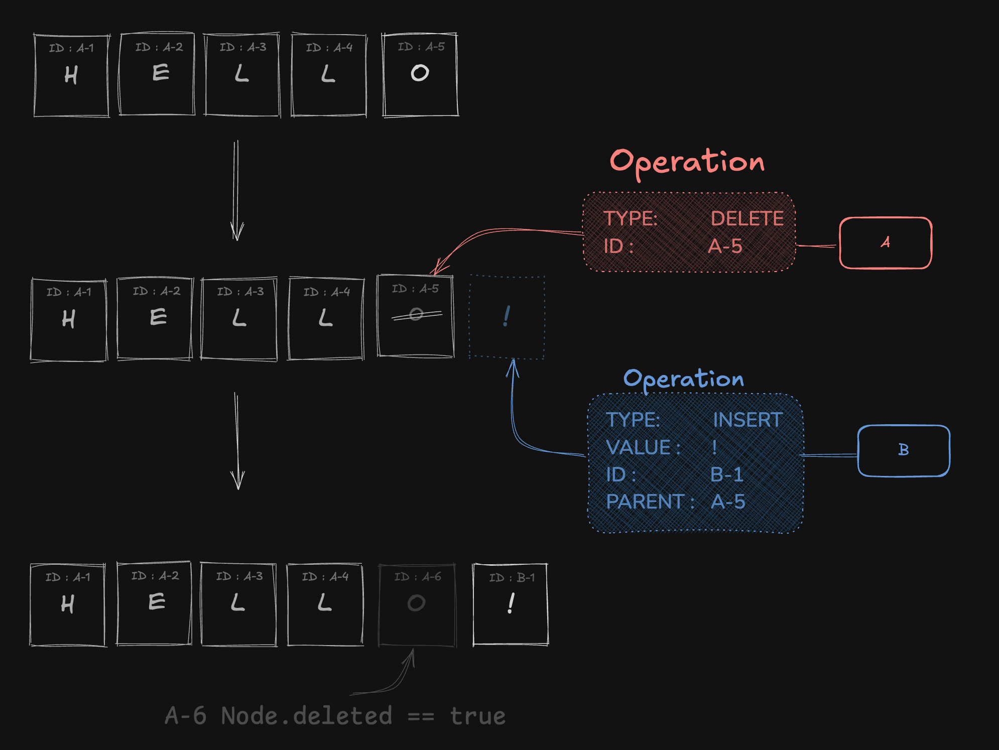

예를 들어:

- A가 노드 `A-5`을 삭제.
- B가 `A-5`의 자녀로 새로운 노드를 Insert.
- A,B Operation 교환

이 경우 A는 `A-5`가 삭제되었으므로 B의 작업을 적용할 수 없습니다. 반대로 B는 A의 삭제 Operation으로 인해 부모 노드를 잃게 됩니다.

이를 방지하기 위해 Node에는 `deleted` 필드가 포함됩니다.

`Tombstone(묘비,무덤표시)`라고 하는데요, 삭제된 데이터를 즉시 제거하는 것이 아니라 "논리적으로 삭제됨" 으로 표시하는 방법 입니다.

데이터를 완전히 삭제하지 않고 "삭제됨" 상태로 유지 하여, 나중에도 참조가 가능하도록 만듭니다.

아래 데모 페이지와 깃허브 저장소를 통해 실제 동작 모습을 직접 확인하실 수 있습니다.

> 데모 URL: [RGA DEMO](https://crdt-algorithm-demo.vercel.app)
> Git 저장소: [Git Repository](https://github.com/cgoinglove/crdt-algorithm)

이번 글에서는 충돌 없이 데이터를 병합하는 CRDT와 그중 RGA 알고리즘의 개념을 간략히 살펴봤습니다.
실제로 Text Editor를 서비스 하겠다 기준으로 구현을 집중하려면 undo,redo 를 위한 Command 패턴, 그리고 데이터 저장 최적화를 위한 작업들도 필요하지만, 기본적인 구조와 동작 원리를 이해하는 데 조금이나마 도움이 되셨길 바랍니다.
